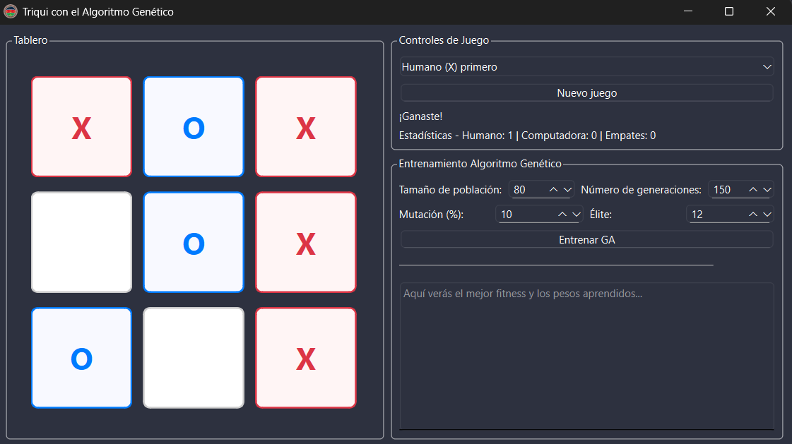

# Triqui con Algoritmo Genético

*Proyecto desarrollado como parte del Parcial 1 - Inteligencia Artificial*



## Descripción

Implementación de un juego de **Triqui (Tic-Tac-Toe)** con inteligencia artificial entrenada mediante **algoritmos genéticos**. El proyecto permite jugar contra una IA configurable y entrenarla para mejorar su rendimiento evolutivamente.

## Características Principales

- 🎯 **IA Entrenable**: Inteligencia artificial que mejora mediante algoritmos genéticos
- 🎮 **Interfaz Gráfica**: Interfaz intuitiva desarrollada con PyQt6
- 📊 **Evolución en Tiempo Real**: Visualización del progreso del entrenamiento
- ⚙️ **Pesos Configurables**: Personalización de los parámetros de la IA
- 🆚 **Múltiples Oponentes**: Diferentes tipos de oponentes (aleatorios, estratégicos)

## Requisitos

- Python 3.8+
- PyQt6 >= 6.6.0

## Instalación

Instala las dependencias:
```bash
pip install -r requirements.txt
```

## Ejecución

Para ejecutar el juego:

```bash
python run.py
```

## Estructura del Proyecto

```
├── logica/               # Lógica del juego y algoritmos
│   ├── algoritmo_genetico/  # Implementación del AG
│   ├── tablero.py          # Gestión del tablero de juego
│   ├── ia.py              # Inteligencia artificial
│   ├── oponentes.py        # Diferentes tipos de oponentes
│   └── simulador.py       # Simulaciones de partidas
├── ui/                   # Interfaz gráfica
├── resources/           # Recursos (imágenes)
└── run.py              # Archivo principal
```

## Funcionamiento

1. **Entrenamiento**: La IA utiliza algoritmos genéticos para evolucionar sus estrategias
2. **Evaluación**: Cada generación es evaluada mediante simulaciones contra diferentes oponentes
3. **Oponentes**: El sistema incluye oponentes aleatorios para diversidad en el entrenamiento
4. **Selección**: Los mejores individuos se seleccionan para crear la siguiente generación
5. **Mejora Continua**: El proceso se repite hasta obtener una IA competitiva

## Algoritmo Genético

- **Población**: Conjunto de IAs con diferentes configuraciones de pesos
- **Fitness**: Evaluación basada en victorias, empates y derrotas
- **Selección**: Por torneo y elitismo
- **Cruce**: Combinación de estrategias exitosas
- **Mutación**: Introducción de variabilidad para explorar nuevas estrategias